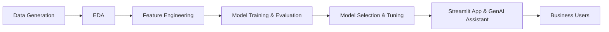

# Predictive Shelf Life Analytics

## 🚩 Problem Statement

In the fast-moving consumer goods (FMCG) industry, especially for companies like **Danone** that manufacture and distribute perishable products (yogurt, milk, cheese, juice, bread), predicting the remaining shelf life of products is a critical challenge. Variability in storage conditions (temperature, humidity, transit time) across the supply chain leads to unpredictable shelf life, resulting in:
- Increased spoilage and waste
- Lost revenue and profit
- Inefficient inventory management
- Negative environmental impact

## 💡 Solution Overview

This project leverages advanced data science and machine learning techniques to **predict the remaining shelf life** of perishable products using historical and environmental data. The solution includes:
- **Synthetic data generation** to simulate real-world scenarios
- **Exploratory Data Analysis (EDA)** to uncover key drivers of shelf life
- **Feature engineering** to enhance model performance
- **Model development** using state-of-the-art algorithms (LightGBM, XGBoost, Random Forest, Linear Regression)
- **Conversational AI assistant** (powered by Gemini) for natural language analytics
- **Streamlit web app** for business users to interactively predict shelf life and receive actionable insights

## 🌟 Business Impact

Implementing predictive shelf life analytics enables organizations to:
- **Reduce spoilage and waste:** Proactively identify at-risk products and take timely action
- **Optimize inventory and logistics:** Improve stock rotation, reduce write-offs, and enhance supply chain efficiency
- **Increase profitability:** Lower costs and maximize product usability
- **Enhance sustainability:** Support environmental goals by minimizing food waste
- **Empower decision-makers:** Make advanced analytics accessible to everyone via a user-friendly app and AI assistant

## 🏗️ Solution Architecture



- **Data Generation:** Synthetic data simulating Danone's product lines and environmental exposures
- **EDA:** Statistical analysis and visualization to understand shelf life drivers
- **Feature Engineering:** Creation of new features (e.g., product age, temp × humidity)
- **Model Training:** Multiple algorithms evaluated for best performance
- **Model Selection:** LightGBM selected for highest accuracy
- **Deployment:** Streamlit app with integrated GenAI assistant for conversational analytics

## 📊 Key Features

- **Interactive Web App:** Predict remaining shelf life based on user input
- **Conversational Analytics:** Ask natural language questions and get instant insights
- **Business Guidance:** Actionable recommendations to maximize shelf life and reduce waste
- **Visualizations:** EDA plots and model performance metrics

## 🧑‍💻 How to Use

1. **Clone the repository and install dependencies:**
   ```sh
   git clone https://github.com/yourusername/predictive_shelf_life_analytics.git
   cd predictive_shelf_life_analytics
   pip install -r requirements.txt
   ```
2. **Run the Streamlit app:**
   ```sh
   streamlit run scripts/streamlit_app.py
   ```
3. **Interact with the app:**  
   - Enter product and environmental data to get shelf life predictions
   - Use the AI assistant to ask questions and receive business insights

## 📈 Results

- **Best Model:** LightGBM (RMSE: 2.75, R²: 0.97)
- **Business Value:** Potential to save millions by reducing spoilage, improving inventory turnover, and supporting sustainability goals

## 📄 License

This project is for educational and demonstration purposes.

## Project Structure
- `data/` - Raw and processed data files
- `notebooks/` - Jupyter or exploratory notebooks
- `scripts/` - Data generation, EDA, modeling, and utility scripts
- `models/` - Saved machine learning models
- `requirements.txt` - Python dependencies
- `README.md` - Project documentation

## Steps
1. Synthetic data creation
2. Exploratory Data Analysis (EDA)
3. Feature engineering
4. Model development
5. Streamlit app for predictions
